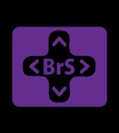
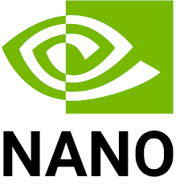

<h1 align="center">Hi 👋, I'm Tung (Son) Do</h1>
<h3 align="center">An Embedded Software Engineer</h3>

- I’m currently working on [Northrop Grumman Collaboration Project](https://github.com/NGCP22-23)

- I’m currently learning [Verilog HDL, FPGA](https://github.com/sontung1010/Verilog_HDL_projects.git)

- All of my projects are available at [Portfolio Drive](https://drive.google.com/drive/folders/1vaCirOclUbUyTWjyfyp_fD1yUCtyca5a?usp=sharing)

- Ask me about **Embedded Systems, Robotics**

- How to reach me **sontungcodedao@gmail.com**

<h3 align="left">Connect with me:</h3>

<h3 align="left">Skills, Languages, and Technologies</h3>

- Languages:

- Libraries:

- Software:

- Firmware:

- Communication Protocols: USB, UART, SPI, I2C, IP, MAVLink

- PCB designing and soldering, 3D printing

#

### Stats

