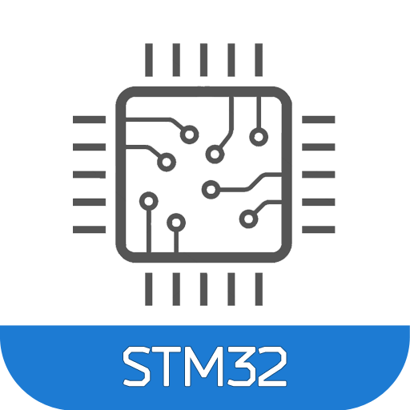
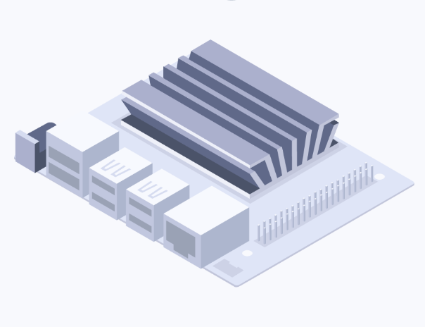
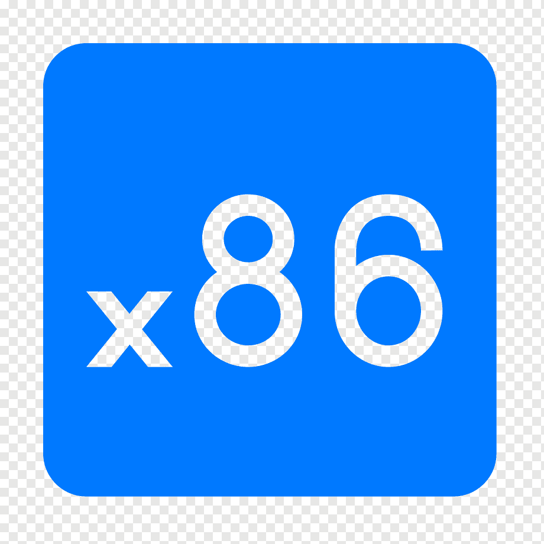
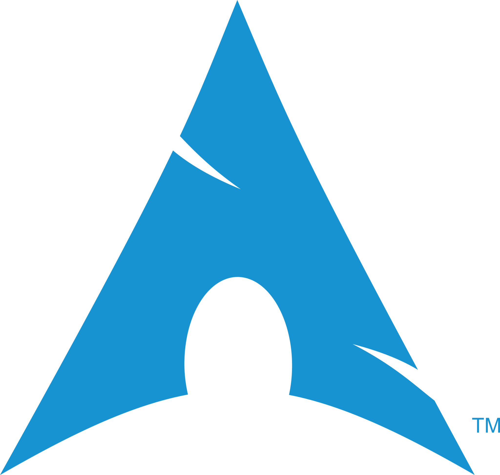
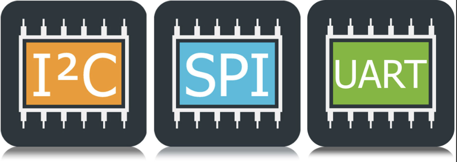
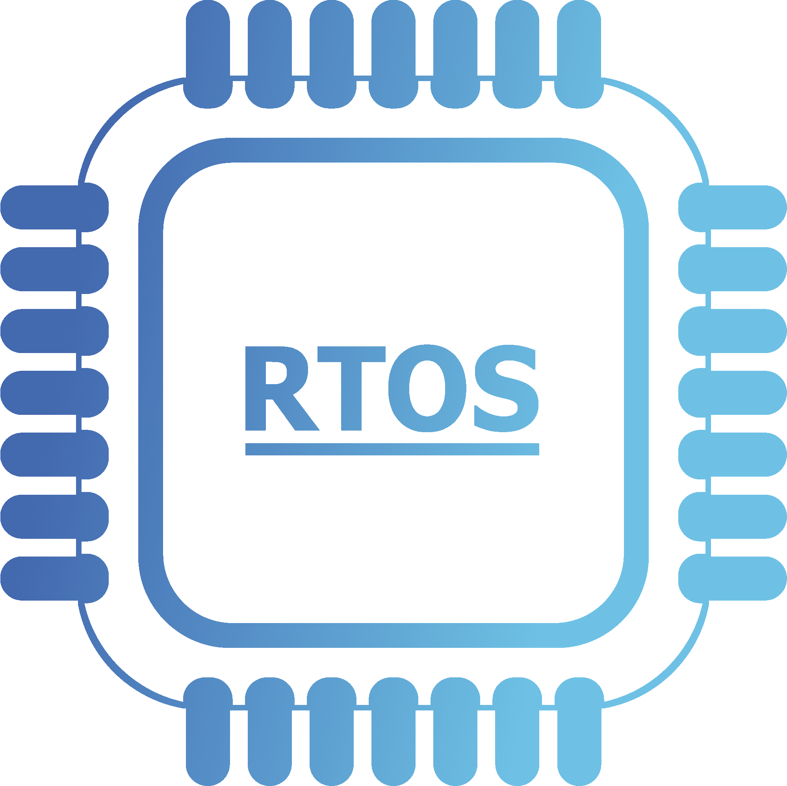
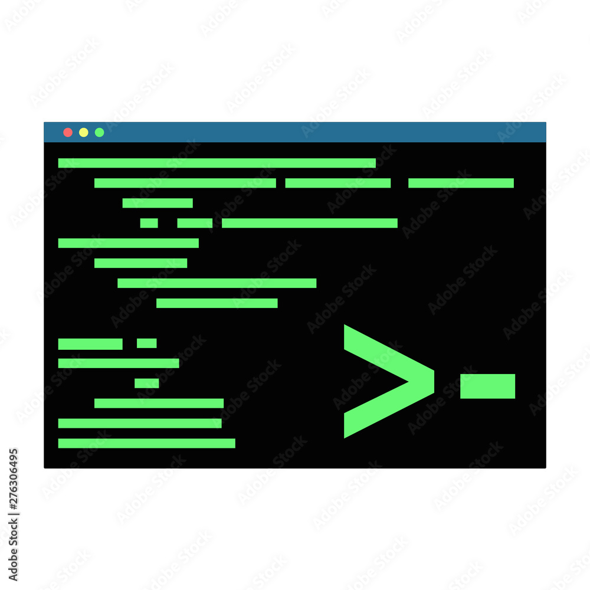
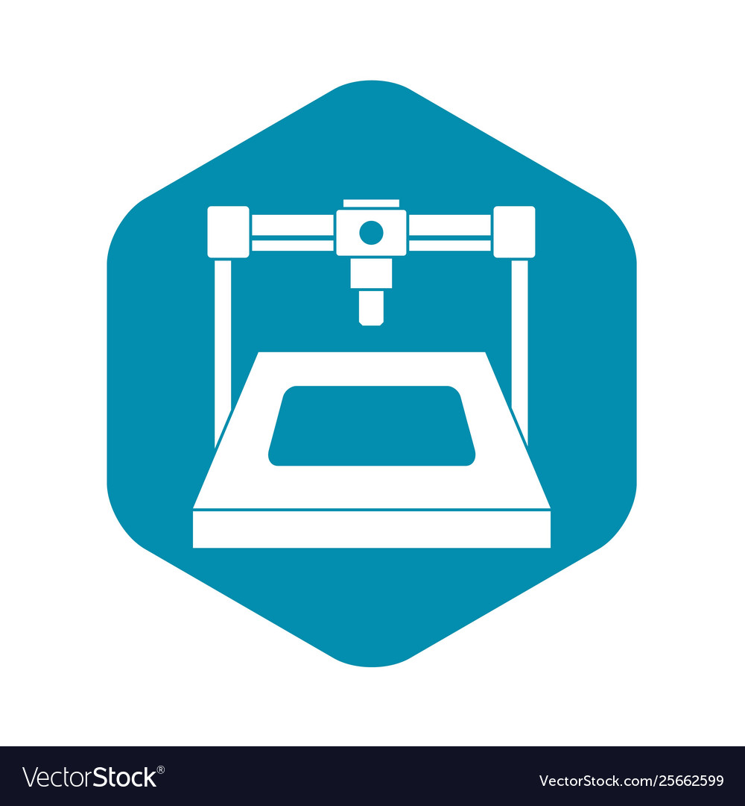

<h1 align="center">Hi 👋, I'm Tung Do</h1>
<h3 align="center">M.Sc. ECE - Robotics candidate</h3>

- I am a Research Assistant at the [ROAHM Lab of University of Michigan, Ann Arbor](https://www.roahmlab.com/)

- All of my projects are available at [Portfolio](https://www.dropbox.com/scl/fo/0xw4jj6wgoqnwkt7s52gx/h?rlkey=olvnlpnuxm5r7crbx4gn53lwq&dl=0)

- Ask me about **Robotics, Embedded Systems, Control Systems, Embedded Software, Computer Vision**

- How to reach me **sontungcodedao@gmail.com**

<h3 align="left">Connect with me:</h3>

<h3 align="left">Skills, Languages, and Technologies</h3>

- Robotics:

<a href="http://wiki.ros.org/rviz" target="_blank" rel="noreferrer">__</a>
<a href="https://gazebosim.org/home" target="_blank" rel="noreferrer">__</a>
<a href="https://opencv.org/" target="_blank" rel="noreferrer">__</a>
<a href="https://numpy.org/" target="_blank" rel="noreferrer">__</a>
<a href="https://pandas.pydata.org/" target="_blank" rel="noreferrer">__</a>

- Languages:

- Firmware:

<a href="https://archlinux.org/" target="_blank" rel="noreferrer">__</a>

<a href="https://riscv.org/" target="_blank" rel="noreferrer">__</a>

<a href="https://eclipseide.org/" target="_blank" rel="noreferrer">__</a>
<a href="https://www.vim.org/" target="_blank" rel="noreferrer">__</a>

<a href="https://git-scm.com/" target="_blank" rel="noreferrer">__</a>
<a href="https://www.mathworks.com/products/simulink.html#:~:text=Simulink%20is%20a%20block%20diagram,and%20deploy%20without%20writing%20code." target="_blank" rel="noreferrer">__</a>

- CAD:
<a href="https://www.solidworks.com/" target="_blank" rel="noreferrer">__</a>

<a href="https://www.ansys.com/" target="_blank" rel="noreferrer">__</a>

&nbsp;

