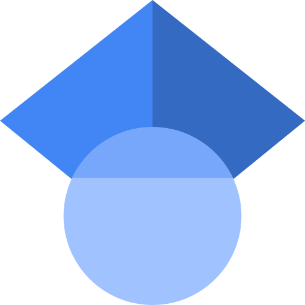

<h1 align="center">Hi 👋, I'm Tung Do</h1>
<h3 align="center">Senior Humanoid Robotics Engineer | Robotics & AI Researcher</h3>

<a href="https://sontung1010.github.io/" target="blank"><strong>Portfolio</strong></a> •
<a href="https://www.linkedin.com/in/tung-do-534525231/" target="blank">LinkedIn</a> •
<a href="https://scholar.google.com/citations?user=UkNYB_QAAAAJ&hl=en" target="blank">Google Scholar</a>

## 🚀 About Me

- 🤖 **Senior Humanoid Robotics Engineer & Technical Project Manager** at **VINMOTION**
- 🎓 **M.Sc. in Electrical and Computer Engineering (Robotics)** — University of Michigan, Ann Arbor
- 🏆 **Valedictorian** — California State Polytechnic University, Pomona

## 🔬 Current Research Focus

- **Control-based robotics and whole-body control architectures**
- **Model-based Reinforcement Learning for humanoid robots**
- **Reinforcement Learning for Loco-Manipulation**
- **Perceptive locomotion using multimodal sensory feedback**
- **Model Predictive Control (MPC) for dynamic locomotion**
- **Sim-to-real transfer for large-scale humanoid systems**

## 🛠 Skills & Technologies

### Robotics & Control
Whole-Body Control • Model Predictive Control (MPC) • Robot Dynamics • Kinematics • Trajectory Optimization • Locomotion Control • State Estimation • Sensor Fusion

### Reinforcement Learning & AI
Model-Based Reinforcement Learning • Loco-Manipulation Learning • Perceptive Locomotion • Deep Reinforcement Learning • Computer Vision • Multimodal Learning

### Robotics Frameworks & Simulation
ROS • ROS2 • MuJoCo • Gazebo • RViz • URDF • SLAM • Simulation-to-Real Transfer

### Programming & Systems
C++ • Python • C • MATLAB • Linux • Bash • Docker • Git • Debugging & Performance Optimization

### Embedded Systems & Hardware
Nvidia Jetson • STM32 • CAN • SPI • I2C • UART • GPIO • PWM

### Mechanical Design & Robot Modeling
SolidWorks • Robot Modeling • 3D Printing

## 📫 Connect with Me

<!-- ## 📊 GitHub Stats

 -->
